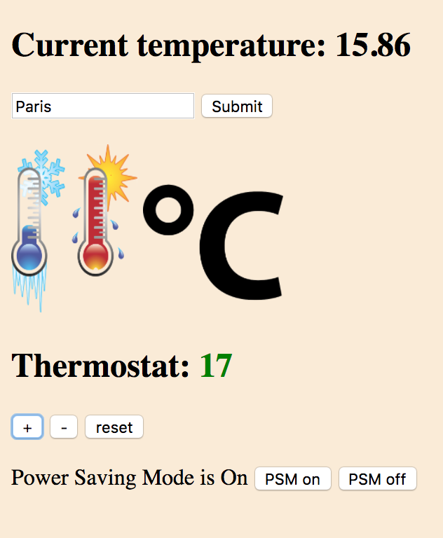

Thermostat
==========

- Build the logic needed to model a simple thermostat
- Use HTML/CSS to create a user interface on the web
- Use jQuery to hook up buttons/links so they run the methods on the underlying thermostat model
- Use a jQuery AJAX call to get the weather information for the user's selected city from a weather API. Display the weather information to the user
- Style the thermostat
- Create a remote API that the thermostat can talk to

Specification
-------
- Thermostat starts at 20 degrees
- You can increase the temperature with an up function
- You can decrease the temperature with a down function
- The minimum temperature is 10 degrees
- If power saving mode is on, the maximum temperature is 25 degrees
- If power saving mode is off, the maximum temperature is 32 degrees
- Power saving mode is on by default
- You can reset the temperature to 20 with a reset function
- You can ask about the thermostat's current energy usage: < 18 is low-usage, < 25 is medium-usage, anything else is high-usage
- Low-usage will be indicated with green, medium-usage indicated with black, high-usage indicated with red

Technologies used
----
- JavaScript
- jQuery
- HTML
- CSS

Tested using:
----
- Jasmine
